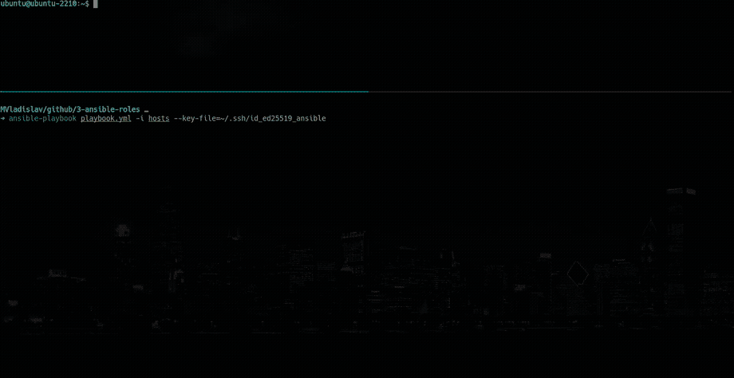
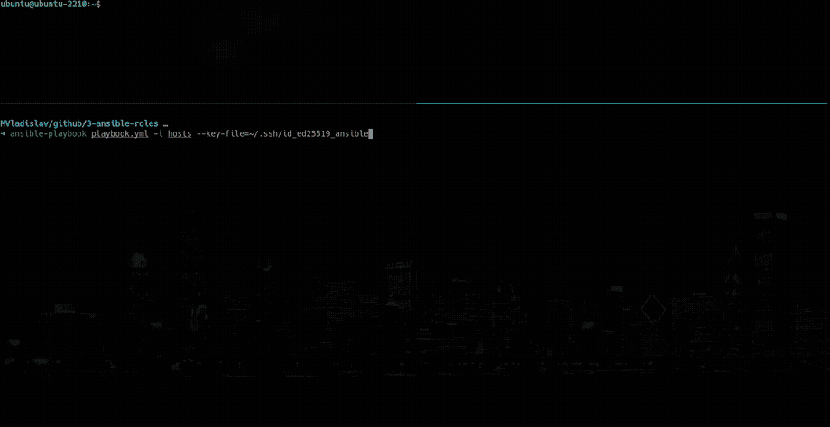

# CIS - Ansible-Docker

[](https://github.com/MVladislav/ansible-docker/actions/workflows/ansible-lint.yml)
[](https://github.com/MVladislav/ansible-docker/actions/workflows/ci.yml)

- [CIS - Ansible-Docker](#cis---ansible-docker)
  - [Role Variables](#role-variables)
  - [Example Playbook](#example-playbook)
  - [Example alias docker-compose \& docker-swarm](#example-alias-docker-compose--docker-swarm)
  - [CIS\_Docker\_Benchmark\_v1.4.0](#cis_docker_benchmark_v140)
  - [License](#license)
  - [Resources](#resources)

---

Install and setup Docker with CIS compliant parts.

Tested with:

- Ubuntu 22.04
- Ubuntu 23.04

Current implemented are most of Section 1-3 (see table below).

This role was developed against a clean install of the Operating System. \
If you are implementing to an existing system please review this role for any site specific changes that are needed.

| root                                   | rootless                                       |
| :------------------------------------- | :--------------------------------------------- |
|  |  |

## Role Variables

```yml
docker_users_to_add_group: []

docker_user_default: docker
docker_group_default: docker
docker_user_shell: /bin/bash

# if swarm mode is needed, this value should be 'true'
# will set in 'daemon.json' the value 'live-restore' to 'false'
# by 'true' the rule 'docker_cis_rule_2_15' will be disabled
docker_is_swarm_mode: false

# SECTION 1
docker_cis_section1: true
docker_cis_rule_1_1_1: true
docker_cis_rule_1_1_2: true
docker_cis_rule_1_1_3: true
docker_cis_rule_1_1_4: true
docker_cis_rule_1_1_5: true
docker_cis_rule_1_1_6: true
docker_cis_rule_1_1_7: true
docker_cis_rule_1_1_8: true
docker_cis_rule_1_1_9: true
docker_cis_rule_1_1_10: true
docker_cis_rule_1_1_11: true
docker_cis_rule_1_1_12: true
docker_cis_rule_1_1_13: true
docker_cis_rule_1_1_14: true
docker_cis_rule_1_1_15: true
docker_cis_rule_1_1_16: true
docker_cis_rule_1_1_17: true
docker_cis_rule_1_1_18: true
docker_cis_rule_1_2_1: true
docker_cis_rule_1_2_2: true

# SECTION 2
docker_cis_section2: true

# install docker in rootless mode under docker user
docker_cis_rule_2_1: true

docker_cis_rule_2_2: false
docker_cis_rule_2_3: true
docker_cis_rule_2_4: true
# TODO: 2.6 is set to false, because runs into failure, need to be checked
docker_cis_rule_2_6: false
# TODO:  2.7 is set to false, because not tested and will run into error
docker_cis_rule_2_7: false
docker_cis_rule_2_8: true

# rule 2.9 is current only active with root mode, and not tested could be not work
# if so set it to false
docker_cis_rule_2_9: true

docker_cis_rule_2_13: true
docker_cis_rule_2_14: true
docker_cis_rule_2_15: true
docker_cis_rule_2_16: true
docker_cis_rule_2_18: true

# SECTION 3
docker_cis_section3: true
docker_cis_rule_3_1: true
docker_cis_rule_3_2: true
docker_cis_rule_3_3: true
docker_cis_rule_3_4: true
docker_cis_rule_3_5: true
docker_cis_rule_3_6: true
docker_cis_rule_3_15: true
docker_cis_rule_3_16: true
docker_cis_rule_3_17: true
docker_cis_rule_3_18: true
docker_cis_rule_3_19: true
docker_cis_rule_3_22: true
docker_cis_rule_3_23: true
docker_cis_rule_3_24: true
```

## Example Playbook

```yml
- hosts: docker
  roles:
    - role: docker
      docker_user_shell: /bin/zsh
      docker_users_to_add_group:
        - name: "{{ ansible_user }}"
      docker_cis_rule_2_1: true # to run install in rootless mode
      docker_is_swarm_mode: true # allow run in swarm mode
```

## Example alias docker-compose & docker-swarm

```sh
alias docker='DOCKER_BUILDKIT=1 docker'
alias docker-compose='DOCKER_BUILDKIT=1 docker compose'
alias docker-swarm-compose='DOCKER_BUILDKIT=1 docker compose config | sed '1{/^name:/d}' | DOCKER_BUILDKIT=1 CONFIG_VERSION=1 docker stack deploy --resolve-image=never --with-registry-auth --compose-file -'
```

## CIS_Docker_Benchmark_v1.4.0

| Index  | Title                                                                                                         | YES |  NO   |
| :----- | :------------------------------------------------------------------------------------------------------------ | :-: | :---: |
| 1      | Host Configuration                                                                                            |  ?  |       |
| 1.1    | Linux Hosts Specific Configuration                                                                            |     |   ?   |
| 1.1.1  | Ensure a separate partition for containers has been created (Automated)                                       |     |   x   |
| 1.1.2  | Ensure only trusted users are allowed to control Docker daemon (Automated)                                    |  x  |       |
| 1.1.3  | Ensure auditing is configured for the Docker daemon - /usr/bin/dockerd (Automated)                            |  x  |       |
| 1.1.4  | Ensure auditing is configured for Docker files and directories - /run/containerd (Automated)                  |  x  |       |
| 1.1.5  | Ensure auditing is configured for Docker files and directories - /var/lib/docker (Automated)                  |  x  |       |
| 1.1.6  | Ensure auditing is configured for Docker files and directories - /etc/docker (Automated)                      |  x  |       |
| 1.1.7  | Ensure auditing is configured for Docker files and directories - docker.service (Automated)                   |  x  |       |
| 1.1.8  | Ensure auditing is configured for Docker files and directories - containerd.sock (Automated)                  |  x  |       |
| 1.1.9  | Ensure auditing is configured for Docker files and directories - docker.socket (Automated)                    |  x  |       |
| 1.1.10 | Ensure auditing is configured for Docker files and directories - /etc/default/docker (Automated)              |  x  |       |
| 1.1.11 | Ensure auditing is configured for Docker files and directories - /etc/docker/daemon.json (Automated)          |  x  |       |
| 1.1.12 | Ensure auditing is configured for Docker files and directories - /etc/containerd/config.toml (Automated)      |  x  |       |
| 1.1.13 | Ensure auditing is configured for Docker files and directories - /etc/sysconfig/docker (Automated)            |  x  |       |
| 1.1.14 | Ensure auditing is configured for Docker files and directories - /usr/bin/containerd (Automated)              |  x  |       |
| 1.1.15 | Ensure auditing is configured for Docker files and directories - /usr/bin/containerd-shim (Automated)         |  x  |       |
| 1.1.16 | Ensure auditing is configured for Docker files and directories - /usr/bin/containerd-shim-runc-v1 (Automated) |  x  |       |
| 1.1.17 | Ensure auditing is configured for Docker files and directories - /usr/bin/containerd-shim-runc-v2 (Automated) |  x  |       |
| 1.1.18 | Ensure auditing is configured for Docker files and directories - /usr/bin/runc (Automated)                    |  x  |       |
| 1.2    | General Configuration                                                                                         |     |   ?   |
| 1.2.1  | Ensure the container host has been Hardened (Manual)                                                          |     |   ?   |
| 1.2.2  | Ensure that the version of Docker is up to date (Manual)                                                      |     |   ?   |
| 2      | Docker daemon configuration                                                                                   |     |   ?   |
| 2.1    | Run the Docker daemon as a non-root user, if possible (Manual)                                                |  x  |       |
| 2.2    | Ensure network traffic is restricted between containers on the default bridge (Automated)                     |  ?  |       |
| 2.3    | Ensure the logging level is set to 'info' (Automated)                                                         |  x  |       |
| 2.4    | Ensure Docker is allowed to make changes to iptables (Automated)                                              |  x  |       |
| 2.5    | Ensure insecure registries are not used (Automated)                                                           |  ?  |       |
| 2.6    | Ensure aufs storage driver is not used (Automated)                                                            |     | TODO: |
| 2.7    | Ensure TLS authentication for Docker daemon is configured (Automated)                                         |     |   ?   |
| 2.8    | Ensure the default ulimit is configured appropriately (Manual)                                                |  x  |       |
| 2.9    | Enable user namespace support (Automated)                                                                     |  ?  |       |
| 2.10   | Ensure the default cgroup usage has been confirmed (Automated)                                                |     |   ?   |
| 2.11   | Ensure base device size is not changed until needed (Automated)                                               |     |   ?   |
| 2.12   | Ensure that authorization for Docker client commands is enabled (Automated)                                   |     |   ?   |
| 2.13   | Ensure centralized and remote logging is configured (Automated)                                               |  x  |       |
| 2.14   | Ensure containers are restricted from acquiring new privileges (Automated)                                    |  x  |       |
| 2.15   | Ensure live restore is enabled (Automated)                                                                    |  x  |       |
| 2.16   | Ensure Userland Proxy is Disabled (Automated)                                                                 |  x  |       |
| 2.17   | Ensure that a daemon-wide custom seccomp profile is applied if appropriate (Manual)                           |     |   ?   |
| 2.18   | Ensure that experimental features are not implemented in production (Automated)                               |  x  |       |
| 3      | Docker daemon configuration files                                                                             |     |   ?   |
| 3.1    | Ensure that the docker.service file ownership is set to root:root (Automated)                                 |  x  |       |
| 3.2    | Ensure that docker.service file permissions are appropriately set (Automated)                                 |  x  |       |
| 3.3    | Ensure that docker.socket file ownership is set to root:root (Automated)                                      |  x  |       |
| 3.4    | Ensure that docker.socket file permissions are set to 644 or more restrictive (Automated)                     |  x  |       |
| 3.5    | Ensure that the /etc/docker directory ownership is set to root:root (Automated)                               |  x  |       |
| 3.6    | Ensure that /etc/docker directory permissions are set to 755 or more restrictively (Automated)                |  x  |       |
| 3.7    | Ensure that registry certificate file ownership is set to root:root (Automated)                               |     |   ?   |
| 3.8    | Ensure that registry certificate file permissions are set to 444 or more restrictively (Automated)            |     |   ?   |
| 3.9    | Ensure that TLS CA certificate file ownership is set to root:root (Automated)                                 |     |   ?   |
| 3.10   | Ensure that TLS CA certificate file permissions are set to 444 or more restrictively (Automated)              |     |   ?   |
| 3.11   | Ensure that Docker server certificate file ownership is set to root:root (Automated)                          |     |   ?   |
| 3.12   | Ensure that the Docker server certificate file permissions are set to 444 or more restrictively (Automated)   |     |   ?   |
| 3.13   | Ensure that the Docker server certificate key file ownership is set to root:root (Automated)                  |     |   ?   |
| 3.14   | Ensure that the Docker server certificate key file permissions are set to 400 (Automated)                     |     |   ?   |
| 3.15   | Ensure that the Docker socket file ownership is set to root:docker (Automated)                                |  x  |       |
| 3.16   | Ensure that the Docker socket file permissions are set to 660 or more restrictively (Automated)               |  x  |       |
| 3.17   | Ensure that the daemon.json file ownership is set to root:root (Automated)                                    |  x  |       |
| 3.18   | Ensure that daemon.json file permissions are set to 644 or more restrictive (Automated)                       |  x  |       |
| 3.19   | Ensure that the /etc/default/docker file ownership is set to root:root (Automated)                            |  x  |       |
| 3.20   | Ensure that the /etc/sysconfig/docker file permissions are set to 644 or more restrictively (Automated)       |     |   ?   |
| 3.21   | Ensure that the /etc/sysconfig/docker file ownership is set to root:root (Automated)                          |     |   ?   |
| 3.22   | Ensure that the /etc/default/docker file permissions are set to 644 or more restrictively (Automated)         |  x  |       |
| 3.23   | Ensure that the Containerd socket file ownership is set to root:root (Automated)                              |  x  |       |
| 3.24   | Ensure that the Containerd socket file permissions are set to 660 or more restrictively (Automated)           |  x  |       |
| 4      | Container Images and Build File Configuration                                                                 |     |       |
| 4.1    | Ensure that a user for the container has been created (Automated)                                             |     |       |
| 4.2    | Ensure that containers use only trusted base images (Manual)                                                  |     |       |
| 4.3    | Ensure that unnecessary packages are not installed in the container (Manual)                                  |     |       |
| 4.4    | Ensure images are scanned and rebuilt to include security patches (Manual)                                    |     |       |
| 4.5    | Ensure Content trust for Docker is Enabled (Automated)                                                        |     |       |
| 4.6    | Ensure that HEALTHCHECK instructions have been added to container images (Automated)                          |     |       |
| 4.7    | Ensure update instructions are not used alone in Dockerfiles (Manual)                                         |     |       |
| 4.8    | Ensure setuid and setgid permissions are removed (Manual)                                                     |     |       |
| 4.9    | Ensure that COPY is used instead of ADD in Dockerfiles (Manual)                                               |     |       |
| 4.10   | Ensure secrets are not stored in Dockerfiles (Manual)                                                         |     |       |
| 4.11   | Ensure only verified packages are installed (Manual)                                                          |     |       |
| 4.12   | Ensure all signed artifacts are validated (Manual)                                                            |     |       |
| 5      | Container Runtime Configuration                                                                               |     |       |
| 5.1    | Ensure that, if applicable, an AppArmor Profile is enabled (Automated)                                        |     |       |
| 5.2    | Ensure that, if applicable, SELinux security options are set (Automated)                                      |     |       |
| 5.3    | Ensure that Linux kernel capabilities are restricted within containers (Automated)                            |     |       |
| 5.4    | Ensure that privileged containers are not used (Automated)                                                    |     |       |
| 5.5    | Ensure sensitive host system directories are not mounted on containers (Automated)                            |     |       |
| 5.6    | Ensure sshd is not run within containers (Automated)                                                          |     |       |
| 5.7    | Ensure privileged ports are not mapped within containers (Automated)                                          |     |       |
| 5.8    | Ensure that only needed ports are open on the container (Manual)                                              |     |       |
| 5.9    | Ensure that the host's network namespace is not shared (Automated)                                            |     |       |
| 5.10   | Ensure that the memory usage for containers is limited (Automated)                                            |     |       |
| 5.11   | Ensure that CPU priority is set appropriately on containers (Automated) . 184                                 |     |       |
| 5.12   | Ensure that the container's root filesystem is mounted as read only (Automated)                               |     |       |
| 5.13   | Ensure that incoming container traffic is bound to a specific host interface (Automated)                      |     |       |
| 5.14   | Ensure that the 'on-failure' container restart policy is set to '5' (Automated)                               |     |       |
| 5.15   | Ensure that the host's process namespace is not shared (Automated)                                            |     |       |
| 5.16   | Ensure that the host's IPC namespace is not shared (Automated)                                                |     |       |
| 5.17   | Ensure that host devices are not directly exposed to containers (Manual) 197                                  |     |       |
| 5.18   | Ensure that the default ulimit is overwritten at runtime if needed (Manual)                                   |     |       |
| 5.19   | Ensure mount propagation mode is not set to shared (Automated)                                                |     |       |
| 5.20   | Ensure that the host's UTS namespace is not shared (Automated)                                                |     |       |
| 5.21   | Ensure the default seccomp profile is not Disabled (Automated)                                                |     |       |
| 5.22   | Ensure that docker exec commands are not used with the privileged option (Automated)                          |     |       |
| 5.23   | Ensure that docker exec commands are not used with the user=root option (Manual)                              |     |       |
| 5.24   | Ensure that cgroup usage is confirmed (Automated)                                                             |     |       |
| 5.25   | Ensure that the container is restricted from acquiring additional privileges (Automated)                      |     |       |
| 5.26   | Ensure that container health is checked at runtime (Automated)                                                |     |       |
| 5.27   | Ensure that Docker commands always make use of the latest version of their image (Manual)                     |     |       |
| 5.28   | Ensure that the PIDs cgroup limit is used (Automated)                                                         |     |       |
| 5.29   | Ensure that Docker's default bridge "docker0" is not used (Manual)                                            |     |       |
| 5.30   | Ensure that the host's user namespaces are not shared (Automated)                                             |     |       |
| 5.31   | Ensure that the Docker socket is not mounted inside any containers (Automated)                                |     |       |
| 6      | Docker Security Operations                                                                                    |     |       |
| 6.1    | Ensure that image sprawl is avoided (Manual)                                                                  |     |       |
| 6.2    | Ensure that container sprawl is avoided (Manual)                                                              |     |       |
| 7      | Docker Swarm Configuration                                                                                    |     |       |
| 7.1    | Ensure swarm mode is not Enabled, if not needed (Automated)                                                   |     |       |
| 7.2    | Ensure that the minimum number of manager nodes have been created in a swarm (Automated)                      |     |       |
| 7.3    | Ensure that swarm services are bound to a specific host interface (Automated)                                 |     |       |
| 7.4    | Ensure that all Docker swarm overlay networks are encrypted (Automated)                                       |     |       |
| 7.5    | Ensure that Docker's secret management commands are used for managing secrets in a swarm cluster (Manual)     |     |       |
| 7.6    | Ensure that swarm manager is run in auto-lock mode (Automated)                                                |     |       |
| 7.7    | Ensure that the swarm manager auto-lock key is rotated periodically (Manual)                                  |     |       |
| 7.8    | Ensure that node certificates are rotated as appropriate (Manual)                                             |     |       |
| 7.9    | Ensure that CA certificates are rotated as appropriate (Manual)                                               |     |       |
| 7.10   | Ensure that management plane traffic is separated from data plane traffic (Manual)                            |     |       |

---

## License

MIT

## Resources

- <https://downloads.cisecurity.org/#/>
- CIS Docker Benchmark v1.4.0
  - <https://downloads.cisecurity.org/download?u=1668819933>
